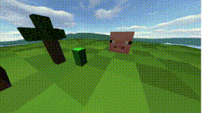
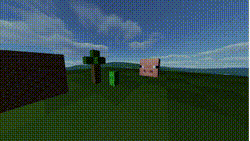

<h1 align="center">Minecraft 3D Scene (OpenGL & C++)</h1>

<p align="center">
<i>An interactive 3D scene inspired by the popular game Minecraft.This project was built from scratch using modern OpenGL to demonstrate fundamental and advanced computer graphics techniques.</i>
</p>

---
## About the project

We chose a scene from the popular game Minecraft as the theme for our project.
The model we created depicts a scene from the aforementioned game, featuring a building/house, a tree,
a Creeper that can be moved, a pig's head that can be scaled (zoomed in and out), 
and an animated sun that moves across the sky, illuminating other objects. The speed of the sun's movement can be changed.
The background and sky were created by texturing a cube with skybox graphics. Our project also features camera movement, 
a Phong lighting model, and the ability to enable a Gaussian blur effect.

## 📸 Project Gallery

<p align="center">
  
  <br>
  <i>Dynamic sun lighting and post-processing blur effect in action.</i>
</p>

### Screenshots
<p align="center">
  
  
</p>

---

## Key Features

**Custom 3D Engine Architecture:** Object-oriented design separating concerns into distinct classes (VAO, VBO, EBO, Shader, Texture) for clean and maintainable code.
**FPS Camera System:** Fully controllable perspective camera with mouse look, zoom (scroll), and keyboard movement.
**Dynamic Phong Lighting:** Realistic lighting model utilizing ambient, diffuse, and specular components. The scene features an animated sun moving across a SkyBox, dynamically affecting object illumination and sky colors.
**Post-Processing (Framebuffers):** Implementation of an off-screen Framebuffer Object (FBO) allowing for real-time post-processing, specifically a togglable Gaussian Blur effect.
**Interactive Entities:** A movable Creeper character and a dynamically scalable Pig head.

## 💻 Tech Stack

* **Language:** C++
  **Graphics API:** OpenGL 3.3 Core Profile 
  **Libraries:**  `GLFW` - Window creation and input handling 
                  `GLAD` - OpenGL function pointer management 
                  `GLM` - Mathematics (matrices, vectors, transformations) 
                  `stb_image` - Texture loading 

## 🎮 Controls

The application features a comprehensive input system for scene interaction:

| Action | Input |
| :--- | :--- |
| **Camera Movement** | `W` `A` `S` `D` |
| **Camera Up / Down** | `Space` / `Left Shift`  |
| **Camera Look / Zoom**| `Mouse` / `Scroll`  |
| **Move Creeper** | `Arrow Keys` (Up, Down, Left, Right) |
| **Scale Pig Head** | `Numpad +` / `Numpad -` |
| **Toggle Gaussian Blur** | `B`  |
| **Adjust Light Speed** | `+` / `-` |
| **Exit** | `ESC` |

## 🛠️ Installation & Build

1. Clone the repository:
   ```bash
   git clone [https://github.com/Miki13-web/3D_OpenGL.git](https://github.com/Miki13-web/3D_OpenGL.git)

